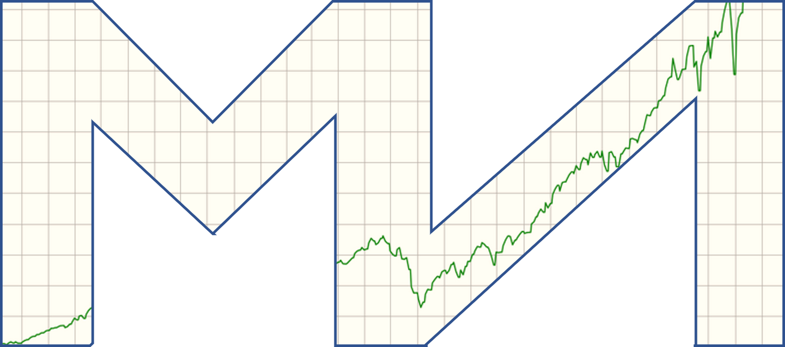
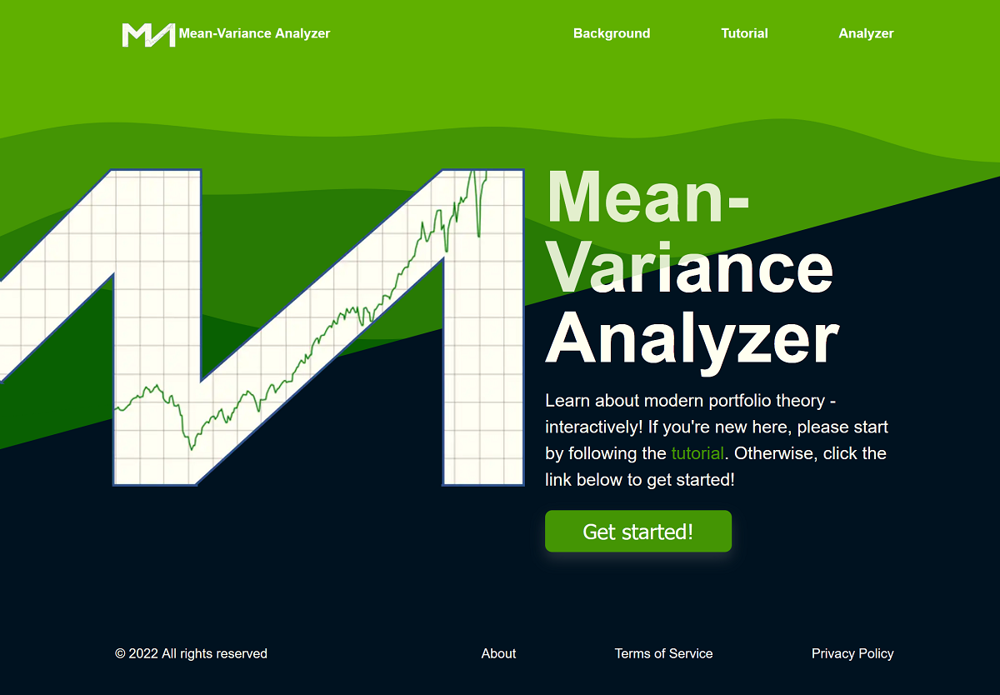
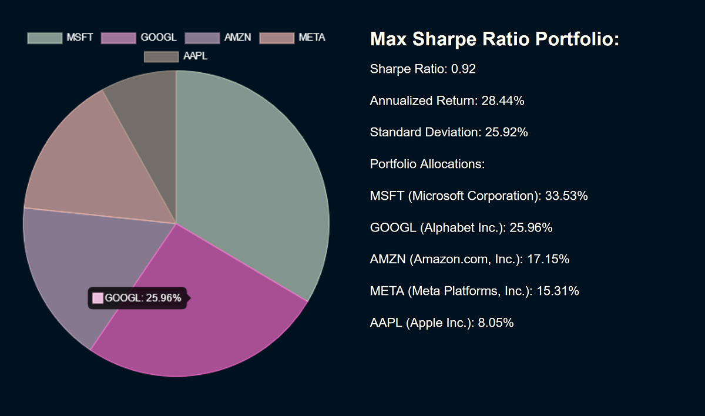

  

<h1 align="center">
  Mean-Variance Analyzer
</h1>

Learn about modern portfolio theory - interactively! [View live site](https://mvanalyzer.dev/)

## Tutorial

Welcome to Mean-Variance Analyzer! MVA is an educational tool meant to
help people new to financial engineering start their journey learning
about the history of portfolio optimization. To get started, click
either the "Get started!" link on the home page (below) or the "Analyzer"
link in the navigation menu.

This should take you to the input form (below). Enter all
the assets of interest into the corresponding input fields. You can
start typing a ticker or company name and if it is in the preloaded
dataset of over 100 popular assets it should appear in the dropdown
datalist and be clickable (you are encouraged to read more about
[how the data was collected](https://github.com/pfischer1687/get-asset-data-for-mva) -
note that the developer is not liable for the accuracy or freshness
of any data or information given on the site as per the
[Terms of Service](https://mvanalyzer.dev/terms/)). You must enter at least
two unique tickers from the dataset and you can press the "+ Add
Asset" button to add up to 15 assets. Once you have chosen all your
assets, you have the option to set the maximum allocation that can be
given to any individual asset in the portfolio (the default is 100%).
This number must be larger than 100% / (#assets - 1) and less than or
equal to 100%. Then you have the option to enter a custom benchmark -
the default value is the the 3 month Treasury bill rate at the time of
this site's development (Jan 2023: 4.54%) but you can enter any custom risk-free rate
between -50% and 50% as your benchmark.

If there are no errors in the input fields, a scatter plot will appear
(example below) giving a visual representation of the approximated
maximum Sharpe ratio (or tangency) portfolio, individual assets,
efficient frontier, Markowitz bullet and capital market line
(explained on the
[Background](https://mvanalyzer.dev/background/) page). You
can hover over or click on points on the plot to see the portfolios
that produced each point on the efficient frontier, the allocations
that produced the tangency portfolio, and the information for each
individual asset. Below that will be a pie chart visualizing the
allocations that produced the tangency portfolio along with its
corresponding information.

Now you're ready to have some fun experimenting. Thank you for
visiting this site and reading the tutorial. I hope you enjoy it and
learn something new!

## Version

1.0.0

## Author

Paul Fischer

- Email: paulfischerdev@gmail.com
- Twitter: [@PaulFis43236408](https://twitter.com/PaulFis43236408)
- GitHub: [pfischer1687](https://github.com/pfischer1687)
- Website: [https://paulfischer.dev/](https://paulfischer.dev/)

## Dependencies

- `chart.js@3.9.1`
- `formik@2.2.9`
- `gatsby@5.4.2`
- `gatsby-plugin-image@3.4.0`
- `gatsby-plugin-manifest@5.4.0`
- `gatsby-plugin-offline@6.4.0`
- `gatsby-plugin-sharp@5.4.0`
- `gatsby-source-filesystem@5.4.0`
- `gatsby-transformer-sharp@5.4.0`
- `react@18.2.0`
- `react-chartjs-2@4.3.1`
- `react-dom@18.2.0`
- `react-katex@3.0.1`
- `yup@0.32.11`

## Dev Dependencies

- `babel-jest@29.4.1`
- `babel-preset-gatsby@3.5.0`
- `identity-obj-proxy@3.0.0`
- `jest@29.4.1`

## Keywords

- Mean-Variance Analysis
- Modern Portfolio Theory (MPT)
- Efficient Frontier
- Ex Post Sharpe Ratio
- Capital Asset Pricing Model (CAPM)
- Monte Carlo Simulation
- Markowitz Bullet
- Capital Market Line (CML)
- Capital Allocation Line (CAL)
- Tangency Portfolio
- Financial Engineering
- Quantitative Finance

## License

© 2022 All rights reserved

Please see the [Terms of Service](https://mvanalyzer.dev/terms/) for more details.

## Scripts

- develop/start: `gatsby develop`
- build: `gatsby build`
- serve: `gatsby serve`
- clean: `gatsby clean`
- test: `jest`

## Repository

git: [https://github.com/pfischer1687/mean-variance-analyzer](https://github.com/pfischer1687/mean-variance-analyzer)

## Bugs

[https://github.com/pfischer1687/mean-variance-analyzer/issues](https://github.com/pfischer1687/mean-variance-analyzer/issues)
