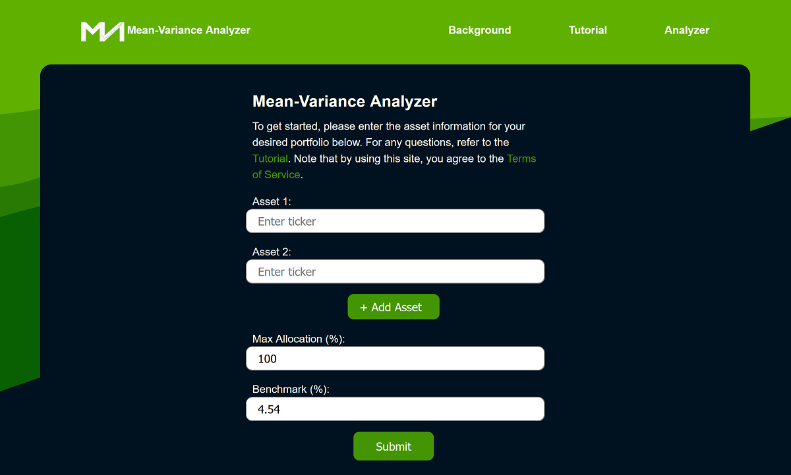

  

<h1 align="center">
  Mean-Variance Analyzer
</h1>

Learn about modern portfolio theory - interactively! <a href="https://meanvarianceanalyzermain.gatsbyjs.io/" target="_blank" rel="noreferrer">View live site</a>

## Excerpt from the Tutorial Page

  Welcome to Mean-Variance Analyzer! MVA is an educational tool meant to
  help people new to financial engineering start their journey learning
  about the history of portfolio optimization. To get started, click
  either the "Get started!" link on the home page (below) or the "Start"
  link in the navigation menu.

  This should take you to the start page input form (below). Enter all
  the assets of interest into the corrsponding input fields. You can
  start typing a ticker or company name and if it is in the preloaded
  dataset of over 100 popular assets it should appear in the dropdown
  datalist and be clickable (you can read more about how the data was
  collected 
  <a
    href="https://github.com/pfischer1687/get-json-data-for-mva"
    target="_blank"
    rel="noreferrer"
  >
    here
  </a> 
  - note that the developer is not not liable in any way for the
  accuracy or freshness of any data or information given on the site as
  per the 
  <a href="https://meanvarianceanalyzermain.gatsbyjs.io/terms" target="_blank" rel="noreferrer">
    Terms of Service
  </a>
  nor is he liable for
  any action or inaction taken due to the site's information as it is an
  educational tool and not qualified to give real financial advice). You
  must enter at least two unique tickers from the dataset and you can
  press the "+ Add Asset" button to add up to 15 assets. Once you have
  chosen all your assets, you have the option to set the maximum
  allocation that can be given to any individual asset in the portfolio
  (the default is 100%). This number must be larger than 100% / (#assets
  - 1) and less than or equal to 100%. Then you have the option to enter
  a custom benchmark - the default value is the the 3 month Treasury
  bill rate at the time of this site's development (November 2022:
  3.72%) but you can enter any value between -50% and 50% to use a
  custom rate, asset, or portfolio as your benchmark.

  If there are no errors in the input fields, a scatter plot should
  appear (below) giving a visual representation of the approximated
  maximum Sharpe ratio, single asset returns, efficient frontier,
  Markowitz bullet and tangency portfolio (explained in the Background
  section below). You can hover over or click on points on the plot to
  see the portfolios that produce each point on the efficient frontier
  (as well as for the max Sharpe ratio and the information for the
  single assets). Below that will be a pie chart visualizing the
  allocations that produced the maximum sharpe ratio and their
  corresponding information.

  Now you're ready to have some fun experimenting! Thank you for
  visiting this site and reading the tutorial. I hope you enjoy it and
  learn something new!

## Version

1.0.0

## Author

Paul Fischer

- Email: paulfischerdev@gmail.com
- Twitter: <a href="https://twitter.com/PaulFis43236408">@PaulFis43236408</a>
- GitHub: <a href="https://github.com/pfischer1687">pfischer1687</a>

## Dependencies

- `chart.js@3.9.1`
- `formik@2.2.9`
- `gatsby@4.24.4`
- `gatsby-plugin-image@2.24.0`
- `gatsby-plugin-manifest@4.24.0`
- `gatsby-plugin-sharp@4.24.0`
- `gatsby-source-filesystem@4.24.0`
- `gatsby-transformer-sharp@4.24.0`
- `react@18.1.0`
- `react-chartjs-2@4.3.1`
- `react-dom@18.1.0`
- `yup@0.32.11`

## Keywords

- Mean-Variance Analysis
- Modern Portfolio Theory (MPT)
- Sharpe Ratio
- Tangency Portfolio
- Markowitz Bullet
- Financial Engineering
- Monte Carlo Simulation

## License

© 2022 All rights reserved

Please see the <a href="#">Terms of Service</a> for more details

## Scripts

- develop/start: `gatsby develop`
- build: `gatsby build`
- serve: `gatsby serve`
- clean: `gatsby clean`

## Repository

git: <a href="https://github.com/pfischer1687/mean-variance-analyzer">https://github.com/pfischer1687/mean-variance-analyzer</a>

## Bugs

<a href="https://github.com/pfischer1687/mean-variance-analyzer">https://github.com/pfischer1687/mean-variance-analyzer</a>
